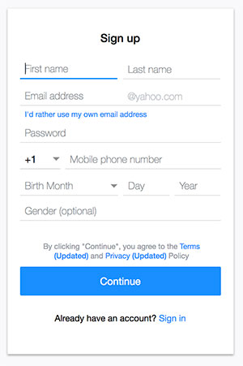
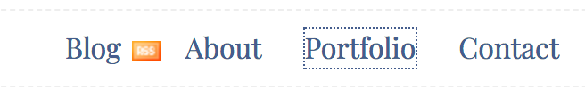
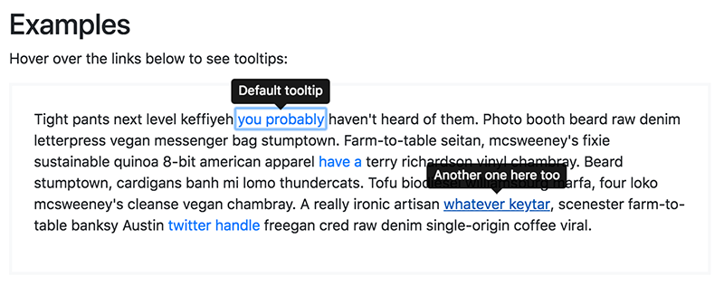

# Selectors

CSS selectors are the means that we utilize to target elements in our DOM tree and apply certain styles to these DOM nodes. The same DOM node can be selected by different types of selectors. It might look intimidating at the beginning but it gets easier to understand when you start working with them. Understanding how selectors work is a corner stone for writing elegant CSS.

## Types of selectors

### The universal selector

The universal selector matches against every element in the DOM tree. It's written using the asterisk `*` like the following:

```css
* {
    /* style that will be applied to the whole document */
}

header * {
    /* style that will be applied to all the elements inside the header tag */
}
```

The universal selector was commonly used for resetting CSS properties on all the elements. It's worth mentioning that it is always feared of being bad for performance. These claims were disproved according to the [tests ran by Steve Souders](http://www.stevesouders.com/blog/2009/03/10/performance-impact-of-css-selectors/) and it was proven that their impact on performance is negligible in real world scenarios.

The most common use of the universal selector nowadays is setting the `box-sizing` like the following:

```css
* {
    box-sizing: border-box;
}
```

Perhaps the fear of the universal selector roots to our old friend IE6 where developers used to target this browser by prefixing the `*` to the properties and not the selector itself. This hack doesn't have anything to do with the universal selector.

```css
li {
    display: inline-block;
    *display: inline; /* will affect IE6 only because IE6 doesn't understand inline-block */
    *zoom: 1;
}
```

### Type / Element selector

Type selector target specific elements according to their matching tag. It simply consists of the name of the tag used different in the HTML. For instance if you want to change the `font-family` for all the `h1` elements in the page that can be done using something like:

```css
h1 {
    font-family: Impact, sans-serif;
}
```

Type selectors -on their own- are very generic and should be used with caution. I commonly see novice developers using it to reset common and useful style that for sure would be needed like removing all the bullets from an unordered list:

```css
ul {
    list-style: none;
}
```

Before you do something like that you should ask yourself, am I 100% sure that I won't the display of a list on any of the pages I am working on? Once you do that, if you ever needed to insert a bulleted list you starts to target that list using different methods to set the bullets back (using class selectors or combined selectors). That could be perfectly fine for you but for someone working with you on the same codebase that can be very confusing.

Another mistake I see as well is using the same example to apply very specific styles to elements that can break other elements. Consider the following:

```css
input {
    width: 300px;
    height: 40px;
    padding: 0 10px;
    font-family: inherit;
}
```

This will make all input elements look the same regardless of their type. The only problem that we are applying the same style to some elements and will break their look like the following:

```css
<input type="submit" />
<input type="checkbox" />
<input type="radio" />
```

I don't think anyone ever saw a checkbox 300px wide. This end by either setting different style to these elements by other means (class selectors, attribute selectors) or using a more appropriate selector for the elements we are targeting.

It's worth mentioning that element selectors are case-insensitive but it is always discouraged to utilize uppercase when you write CSS in general.

### Class selector

An HTML class is an attribute used to landmark an element in order to select it. It's like a label we give to the elements to facilitate the way of *selecting* them in the future.

Classes are case-sensitive and are writing by prefixing the class name with a dot:

```html
<style>
    .intro {
        font-size: 20px;
        color: red;
    }
</style>

<p class="intro">This paragraph's color will be red and its font-size is 20px</p>

<p>This paragraph will not be affected by properties in the .intro class</p>
```

Most of the time we target elements using class selectors. Even most of CSS writing methodologies are based on strategies about picking an accurate and a self-explanatory class name (see CSS writing methodologies). An element can have multiple classes and these classes can interfere with each other. We will discuss that when talking about the cascade and the specificity.

### Pseudoclass selectors

The word pseudo means something something that appear like something else that confuse the observer on the first sight. Pseudo-classes are combined to other selectors to modify their style when they are on a certain *state*. This is why I like to call them **state selectors**.

#### `:hover` selector

Perhaps the most commonly known selector of this type is the `:hover` selector. The `:hover` targets an element when the user move the pointer's cursor over it. Consider the following example:

```html
<style>
    a:hover {
        text-decoration: none;
    }
</style>

<p>Please check the information posted on our <a href="privacy-policy.html">privacy policy</a> before continueing to use this service.</p>
```

When the user move the pointer over the `<a>` tag, the underlying text below the link will disappear. Note how these types of selectors are written; it starts with a column then the keyword is attacked to it directly.

> 📜 **A little bit of history **
>
> The `:hover` selector is supported on every type of elements but that wasn't always the case. On IE6, the `:hover` selector used to work on anchor tags only. Also, IE7 and IE8 used to ignore the `:hover` selector if a strict doctype is not used.  Developers used to mimic the hover effect by using JavaScript to add and remove classes like `.hover` on `mouseEnter` / `mouseLeave` events on elements. This was a commonly used technique when creating drop down menus as the the submenu was being displayed when the user hover the `li` and not the `a` inside. This technique was first described on [a list a part](http://alistapart.com/article/dropdowns) and was called Suckerfish Dropdown back in 2003!

Be careful of using the hover to change the dimensions of an element or the size of its text. It will reposition the surrounding elements and text and will also trigger what we call the *reflow* or *layout thrashing* which is a performance bottle neck (see reflow, repainting). Instead, use CSS transition to achieve a similar effect. Consider the following:

```css
a {
  font-size: 12px;  
}

/* This is horrible and you don't want to do that */
a:hover {
    font-size: 16px;
}

/* This won't trigger reflow and will perform better */
a:hover {
    transform: scale(1.34);
}
```

#### `:focus` selector

The focus selector target elements that are focusable either by using keyboard or mouse. Some elements are focusable by default like anchors and inputs. Other non-focusable elements can be made focusable as well by setting their `tabindex` attribute to a non-negative integers (see `tabindex` in HTML).

The focus selector plays a great role on making your document more accessible. Everyone benefits from it not just users who uses keyboard for navigation. When used in forms, it brings the user attention to the field he's focusing on. You probably are requested constantly to remove these blue lines from the text input when the user focus them on Chrome:


While they seem annoying for anyone from a design perspective, this outlines helps bringing the user attention to the field being focused. It's common to see novice developers getting rid of these lines by using:

```css
input:focus {
    outline: none;
}
```

This is bad for everyone. A more appropriate approach will be removing the lines and providing something else that looks good. Consider the following example from Yahoo's registration page:



The First name field has a thick blue border at the bottom unlike the rest. See there is no harm on removing the outline, you should however provide something else to give a hint about the focus.

Another common issue reported to developers is to remove the dotted outline around the links that look like the following on Firefox



This outline is the style that Firefox applies to the links that receive focus. OK let's get something off the road first ... If someone is to discover something like that then that user must've used the tabs to navigate the page. Anyone who would use something like that will fall in love quickly with the landmark  that says where you are now exactly ... Why would anyone want to remove that?

The answer is, some people discover this without using the tab for navigation. For instance, if you clicked a link that open in a new browser window then you close that window you will find that the link has received focus. The user knows nothing about the focus state nor using the keyboard for navigation. S/he think it's odd and report it.

Another common use for the focus state is to mimic the behaviors shown on hover. Below is a screenshot taken from [the documentation](https://getbootstrap.com/docs/4.1/components/tooltips/) of the popular UI toolkit Bootstrap featuring the tooltip component.



Tooltips are displayed on hover. To improve accessibility, the tooltip is displayed for those who focus the element as well. Can you figure out which one received the focus and which one received the hover? Correct; the tooltip at the top was triggered using the focus (can you see the focus outline on the link?) and the one at the bottom received the hover (notice the underline added to to this particular link). Bootstrap uses JavaScript to display these information but the same can be applied with CSS using focus state and a different type of selectors we will discuss later on.

The last think about focus is that it can be used to **bring user attention to an element that looks inert by default** although it can be interactive. Consider the following HTML of an accordion component on a web page:

```html
<h2>How can I sign up?</h2>
<p>Information about sign up</p>

<h2>What's the available payment options?</h2>
<p>Inforrmation about payment options</p>
```

Accordions are common on the web, they help us save space on the page and help the user to check the topics faster. A common pattern is to make the title *clickable* using JavaScript and collapse/expand the content below it accordingly. Making the element focusable only require adding the attribute `tabindex` then we can add style to indicate to the user that this title has been focused and it can be opened if you pressed Enter on your keyboard:

```html
<style>
    h2:focus {
        text-indent: 30px;
        font-style: italic;
    }
</style>

<h2 tabindex="0">How can I sign up?</h2>
<p>Information about sign up</p>

<h2 tabindex="0">What's the available payment options?</h2>
<p>Inforrmation about payment options</p>
```

#### `:focus-within` selector

`:focus-within` is a relatively new pseudo-class selector. It matches an element that have a child element within its tree that received focus. This selector has been a dream for many developers who cared about making their content accessible because it enables us to achieve effects and behaviors that weren't available without the use of JavaScript.

A common problem it solves is the navigation of dropdown menus using keyboard. The submenu only displays using `:hover` on the parent `li` and can be made visible if its title receive a focus. Once the focus move on to the submenu, the menu disappear because it is no longer receiving the focus nor the hover. To get a better understanding of the behavior you can check [this pen](https://codepen.io/ahmadalfy/pen/ppJGBJ) and try to navigate it using the `tab` key.

Another common pattern this selector helps to solve is the customization of the `select` element. This technique was described by [filament group](https://github.com/filamentgroup/select-css) with a single flaw; you cannot change the caret's orientation when the `select` is opened. Using `:focus-within` can help you overcome that because when the select is opened, it will be focused and the wrapper can be selected using that selector to apply any style we want to the caret.

------

Remaining:

* Pseudo-classes

  * `:active`, `:target`
  * Form pseudo-classes `:invalid`, `:required`, `:checked`
  * Links pseudo-classes `:link`, `:visited`

* Attribute selectors

* Element position selectors `:first-child`, `:nth-child` ... etc

* Negation selector: `:not`

* Language selector `:lang`

* Matching selector `:matches`

* Direction selector `:dir`

* Pseudo elements `::before`, `::after`

* ID selectors

* Combining selectors:

  * Regular nesting
  * Direct descendent `>`
  * Direct sibling `+`
  * All siblings `~`
  